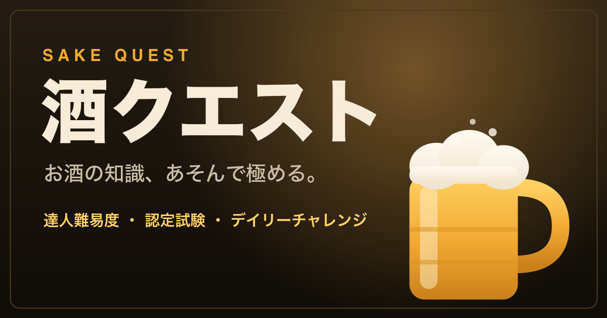

# 酒クエスト 〜お酒の知識クイズ〜



ビール・日本酒・焼酎・ワイン・ウイスキー・カクテルの知識を、あそんで極めるクイズアプリ。
ビルド不要・**単一の `index.html` で完結**する、依存ゼロのブラウザアプリです。

**▶ 遊ぶ: https://mh-mobile.github.io/sake_quest/**

> お酒は20歳になってから。飲酒は適量を守って楽しみましょう。

---

## ✨ 特徴

- **全202問・7ジャンル・4難易度** — 初級〜「達人（★★★★）」までの手応え
- **エキスパート認定試験** — 全ジャンル横断の20問一発勝負。合格で認定証と称号（認定エキスパート／酒匠／マスターソムリエ）
- **デイリーチャレンジ** — 日替わりの5問と「🔥 連続日数（ストリーク）」
- **成績ダッシュボード** — 難易度別・ジャンル別の正答率と、弱点ジャンルの提案
- **知識図鑑・きほんノート・用語集** — 正解でカードを収集、文中の用語はタップで解説ポップアップ
- **ゲーミフィケーション** — XP／レベル＆称号／コンボ／スピードボーナス／23種類のバッジ
- **苦手を復習** — 間違えた問題だけを集めて再挑戦
- **効果音・バイブ（オン/オフ可）** — Web Audioで生成するのでオフラインでも鳴ります
- **データ管理** — 進捗のバックアップ（コピー）／復元（貼り付け）／リセット
- **PWA対応** — ホーム画面に追加でき、オフラインでも動作
- **結果シェア** — Web Share API（非対応時はクリップボードにコピー）

## 🍶 ジャンルと難易度

| ジャンル | 問題数 |
| --- | --- |
| 🔰 お酒のきほん | 33 |
| 🍺 ビール | 33 |
| 🍶 日本酒 | 30 |
| 🍠 焼酎・泡盛 | 23 |
| 🍷 ワイン | 28 |
| 🥃 ウイスキー | 28 |
| 🍸 カクテル | 27 |

難易度は **初級（★☆☆☆）/ 中級（★★☆☆）/ 上級（★★★☆）/ 達人（★★★★）** の4段階。

## 🎮 遊び方

1. ジャンルと難易度を選んでクイズに挑戦（1セッション10問）
2. 各問20秒。素早い正解でスピードボーナス、連続正解でコンボ
3. 初めて正解した問題は「図鑑」に収集され、間違えた問題は「復習」に追加
4. XPを貯めてレベルアップ、バッジを集めて「エキスパート認定試験」で腕試し

## 🛠 技術

- 追加ライブラリ・ビルドツールなしのバニラ JavaScript / CSS / HTML
- 状態は `localStorage` に保存（キー: `sakeQuestState_v2`）
- 効果音は Web Audio API で生成（音声ファイル不要）
- PWA: `manifest.webmanifest` ＋ Service Worker（`sw.js`）
- ホスティング: GitHub Pages

## 💻 ローカルで動かす

`index.html` を直接開いても動きますが、Service Worker を有効にするにはローカルサーバー経由が確実です。

```bash
# リポジトリのルートで
python3 -m http.server 8000
# → http://localhost:8000/ を開く
```

## 📁 構成

```
index.html              アプリ本体（HTML/CSS/JS すべて内包）
sw.js                   Service Worker（オフライン対応）
manifest.webmanifest    PWA マニフェスト
icon-192.png / icon-512.png / icon-maskable-512.png   アプリアイコン
apple-touch-icon.png    iOS ホーム画面用アイコン
favicon.ico             ファビコン
ogp.png                 OGP / Twitter カード画像（1200x630）
icon.svg / icon-maskable.svg   アイコンの元データ
tests/app.test.js       自動テスト（データ検査＋ロジック）
.github/workflows/ci.yml   CI（プッシュごとに構文チェック＋テスト）
```

## 🧑‍💻 開発メモ

### テスト

```bash
node tests/app.test.js
```

問題データの検査（4択・重複・カテゴリ/難易度の妥当性）と、主要ロジック（認定試験・デイリー・ストリーク・スピードボーナス・画面描画）のテストが走ります。GitHub Actions（`.github/workflows/ci.yml`）でプッシュごとに自動実行されます。

### 問題を追加する

`index.html` 内の `QUESTIONS` 配列に追記します。

```js
{ cat:"beer", d:2, q:"問題文", c:["正解","不正解1","不正解2","不正解3"], exp:"解説" }
```

- `c` の **先頭要素が正解**（表示時にシャッフルされます）
- `d` は難易度（1〜4）
- ID は「カテゴリ内の並び順」から自動採番されるため、**各カテゴリの末尾に追加**すると既存ユーザーの進捗（図鑑・苦手）が保たれます

### 用語・レッスンを追加する

- 用語集ポップアップ: `GLOSSARY` 配列（`names` に本文中でリンク化する表記を指定）
- きほんノート: `LESSONS` オブジェクト（カテゴリごとのページ配列）

### アセットを更新したら

アイコンや `manifest.webmanifest` などを差し替えたら、`sw.js` の `VERSION` を上げてください。既存ユーザーのキャッシュが更新され、次回アクセス時に自動で新版へ切り替わります。

## 📄 ライセンス

[MIT License](LICENSE) © 2026 mh-mobile
